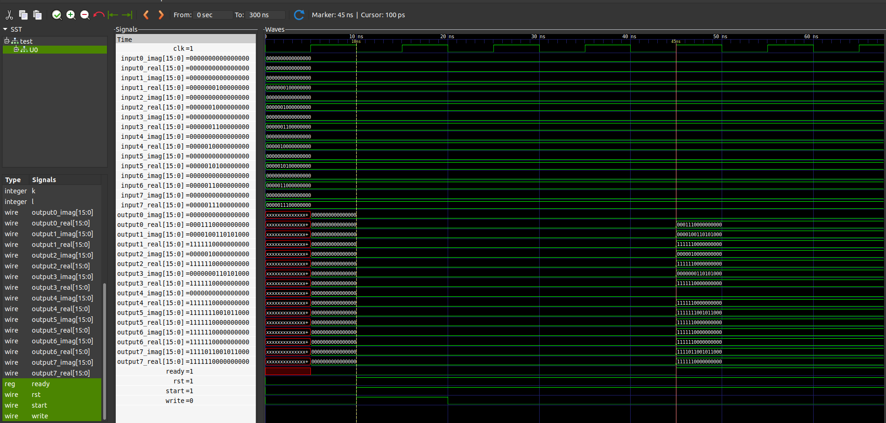
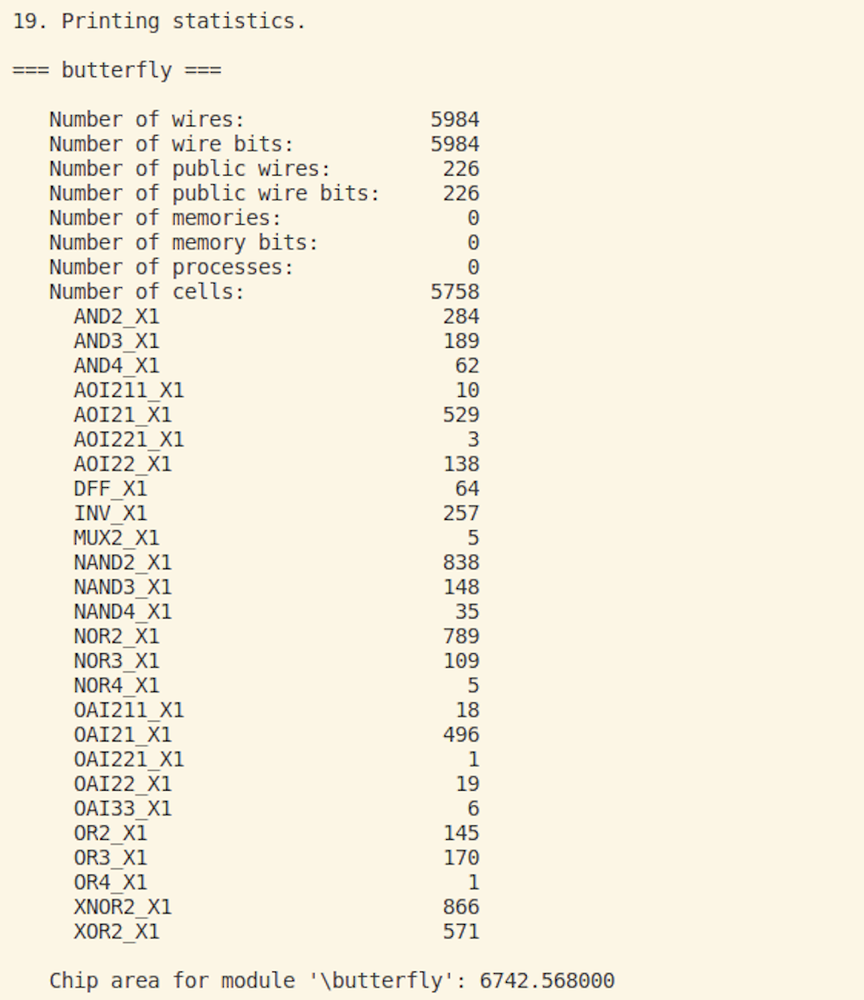
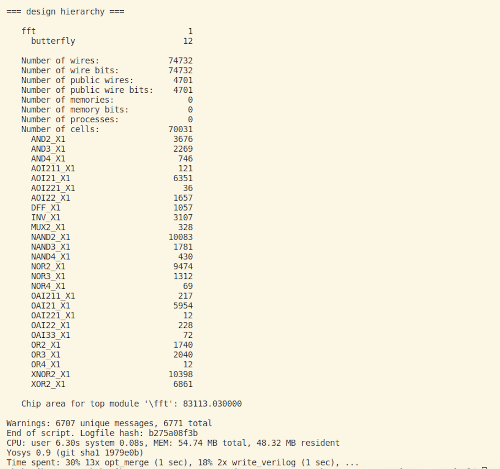
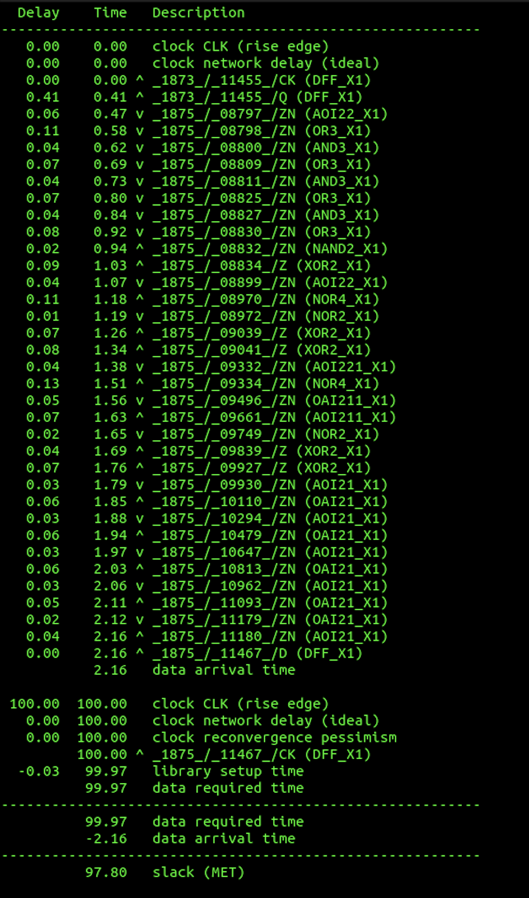
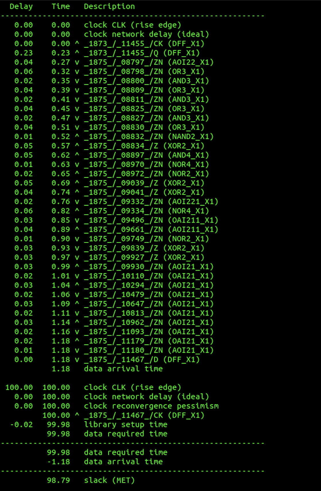
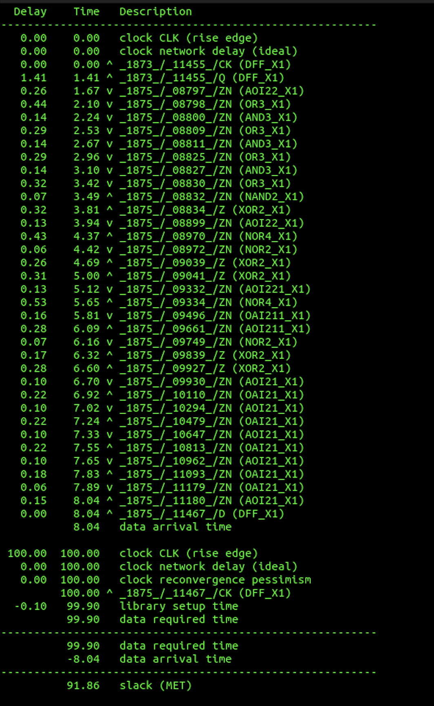
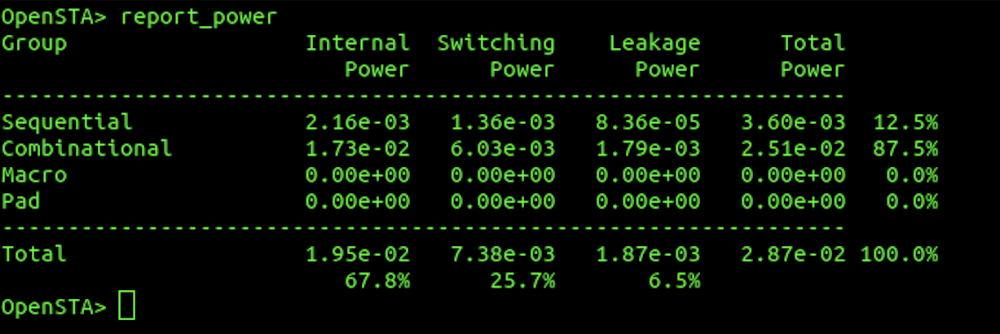
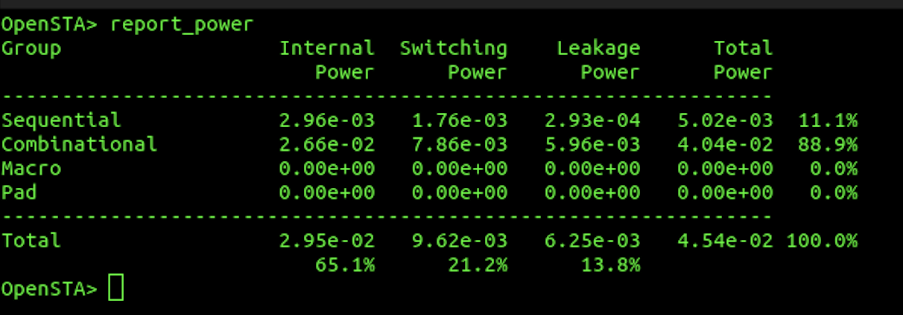
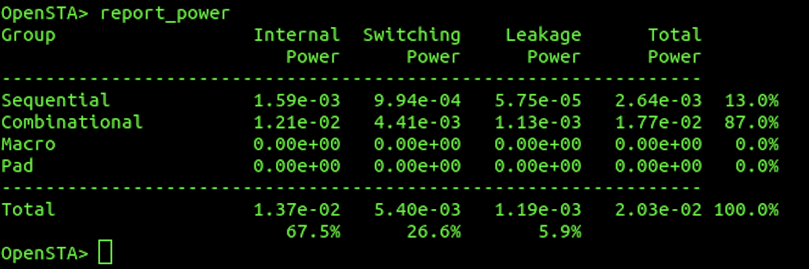

# 8_point_FFT

8 point DIT FFT implementation in verilog

## GTK Wave Output

The output from GTK wave is shown below.

## Synthesis using Yosys

* Synthesis using Yosys
* To synthesise using, yosys there are three folders named, "**fast", "slow" , "typical"**, these folders contains the standard cell libraries of 45nm technology.

* navigate to the folder using command `cd 8_point_FFT/<folder name>/ `
* There is a file in each folder named as `synth_<folder_name>.ys`.

* To synthesise the design `yosys synth_<folder_name>.ys`
   

The area occupied by the synthesised design in yosys output is shown below.

The chip area for module butterfly is $6742.568 \mu m^2$

The chip area for entire design is $83113.03 \mu m^2$.

## STA using OpenSTA

* In the directory `8_point_FFT/<directory_name>` there are scripts named `sta_<folder_name>.bash`.
* To perform STA enter the command `sta` , and then source the bash script.

The STA report is shown below for typical when a clk of 100ns is given.

**The slack is 97.80 $\Rightarrow$ The min clock speed at typical is 2.2ns**

The STA report is shown below for fast when a clk of 100ns is given.

**The slack is 98.79 $\Rightarrow$ The min clock speed at fast is 1.21ns**

The STA report is shown below for slow when a clk of 100ns is given.

**The slack is 91.86 $\Rightarrow$ The min clock speed at slow is 8.14ns.**

**The circuit to work properly at all conditions then the min clock speed should be 8.14ns.**

## Power Consumption

* The power consumption at all the corners fast, typical and slow at 8.14ns is shown below.

Power consumption at typical corner

**The power consumption at the typical corner is 28.7mW.**

Power consumption at fast corner

**The power consumption at the fastest corner is 45.4mW.**

Power consumption at slow corner

**The power consumption at the slowest corner is 20.3mW.**
